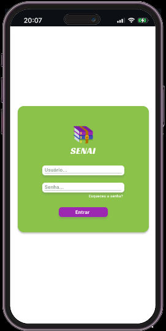
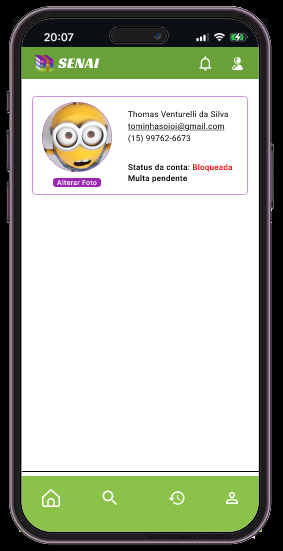
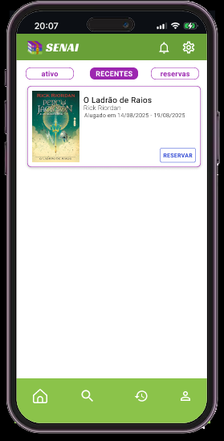

# User-Interface
Interface para o usuário

## Mobile

### Tela inicial / Menu principal

 

- Botões ou ícones para acessar as principais áreas (Livros, Destaques, Meu Perfil, Histórico, Reservas, Configurações).
- Pode ter um banner com novidades ou promoções do acervo.
- Livros destaques e botão de reservar/pegar emprestado.
- Uma sessão de livros de os mais populares passando em carrossel.
- Livros recomendados, novos ou mais emprestados.

### Página de Livros + Pesquisa

- Campo de busca (por título, autor, categoria).
- Filtros (gênero, disponibilidade, mais populares).
- Lista com capa + título + autor + status (disponível / emprestado / reservado).
- Botão para reservar ou pegar emprestado (se disponível).
- Pode ter carrossel de capas ou lista com resenhas rápidas.

### Página do Usuário / Perfil

- Foto e nome do usuário.
- Dados de contato.
- Status de multa (se houver).
- Link rápido para histórico, reservas e configurações.

### Página de Histórico

|  |  |  |
|--------------------------------|--------------------------------|--------------------------------|

- Seção 1: Livros atualmente alugados (com data de devolução e botão para renovar).
- Seção 2: Livros já alugados no passado.
- Seção 3: Reservas (com posição na fila de espera).

### Página de Notificações

- Lembretes de devolução.
- Avisos sobre reservas disponíveis.
- Cobrança de multa.
- Mensagens gerais da biblioteca.

### Página de Configurações
- Alterar dados pessoais.
- Preferências de notificação.
- Alterar senha.
- Sair da conta.

[Abrir protótipo no Figma](https://www.figma.com/proto/MmMfYzk8pks8J2KWb7PVpI/Untitled?node-id=166-2&p=f&t=9QoUWYaFTWtZV4js-1&scaling=min-zoom&content-scaling=fixed&page-id=10%3A151&starting-point-node-id=166%3A2)
